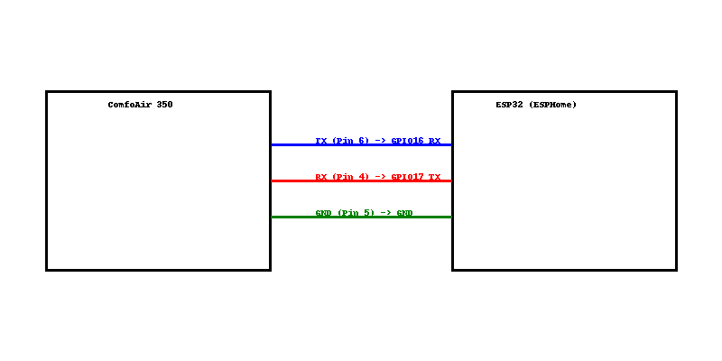

# ComfoAir 350 ESPHome Integration

---

> **DIY Integration of Zehnder ComfoAir 350 into Home Assistant using ESPHome and ESP32. Local control, no cloud dependency.**

---

## About

This project integrates the Zehnder ComfoAir 350 ventilation system into Home Assistant via an ESP32 running ESPHome.  
It provides full local monitoring and control — no cloud services required.

- Monitors supply, exhaust, fresh and return air temperatures
- Displays filter status and bypass status
- Allows control over ventilation power, fan speed and manual bypass override
- Fully local WiFi control
- Flexible and expandable structure

---

## Features

- Full Home Assistant integration
- Local control via WiFi, no external cloud services
- Easy setup using ESPHome
- Flexible YAML and C++ structure for future extensions
- Clean Home Assistant dashboard template included

---

## Installation

1. Flash your ESP32 using the provided `comfoair350.yaml`.
2. Connect ESP32 UART to ComfoAir 350 via RJ45:
   - TX → RX (Pin 4)
   - RX → TX (Pin 6, through optional 10k resistor)
   - GND → GND (Pin 5)
3. Upload provided YAML and components folder into ESPHome.
4. Add `dashboard.yaml` to your Home Assistant configuration.
5. Enjoy local smart control of your ventilation system!

*(See `wiring_diagram.png` for detailed wiring.)*

---

## Setup Diagram

---

## Roadmap

- Add automatic bypass optimization
- Push filter maintenance notifications
- Optional dynamic fan control based on temperature or energy tariffs
- Energy saving modes

---

## Screenshots

*TODO*

---

## License

MIT License 

---
